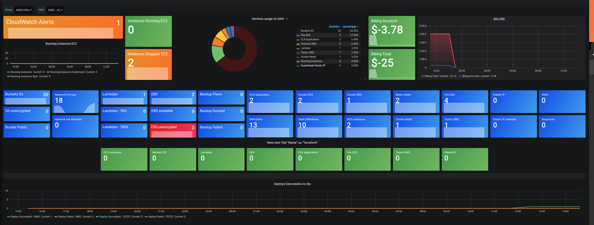

# grafana-zabbix-aws

Projeto baseado no trabalho desenvolvido pelo Victor Fonseca (https://github.com/victorcfonseca/GrafanaDashboardAWS).
A solução usa o Zabbix e o Grafana para monitoramento de recursos utillizados na AWS. O Zabbix coleta as informaçes através da AWS Cli e o Grafana exibe os itens no dashboard.
O monitoramento do Zabbix e o Dashboard do Grafana foram configurados para uso em múltiplos perfis da AWS, portanto as macros do template devem ser configuradas de acordo com as contas da AWS.

#### Ambiente utilizado:
- Ubuntu: 18.04.3 LTS
- Zabbix 4.4.6
- Grafana 6.6.2
- AWS Cli (os profiles monitorados deve ser configurados para o usuário local do Zabbix)

O resultado ser o dashboard abaixo:

### Diretórios:

#### Grafana:
* Json que deve ser importado no Grafana

#### Zabbix:
* userparameter_aws.conf: Configuração dos itens monitorados pelo Zabbix Agent.
* aws: scripts utilizados pelos monitoramentos do Zabbix Trapper.
* cron_aws.sh: Script com os monitoramentos coletados via Zabbix Trapper.
* external scripts: Scripts utilizados pelos monitoramentos do Zabbix Agent.
* zbx_export_templates.xml: Template a ser importado no Zabbix Server e vinculado aos hosts para monitoramento das contas.

#### AWS:
* policy_zabbix_monitor.json: Policy que deve ser utilizada ao usuário utilizado pelo Zabbix nas coletas.
* policy_bucket.tpl: Policy que deve ser configurada nos buckets para verificação da Criptografia.

Se tiverem dúvidas ou sugestões, segue meu contato:
* https://www.linkedin.com/in/nataliavaz/

